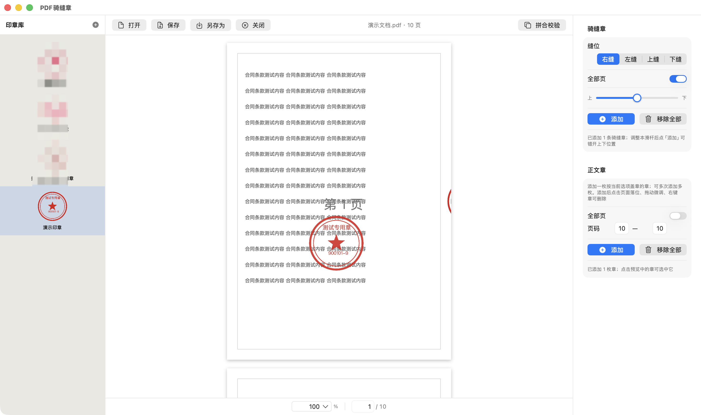
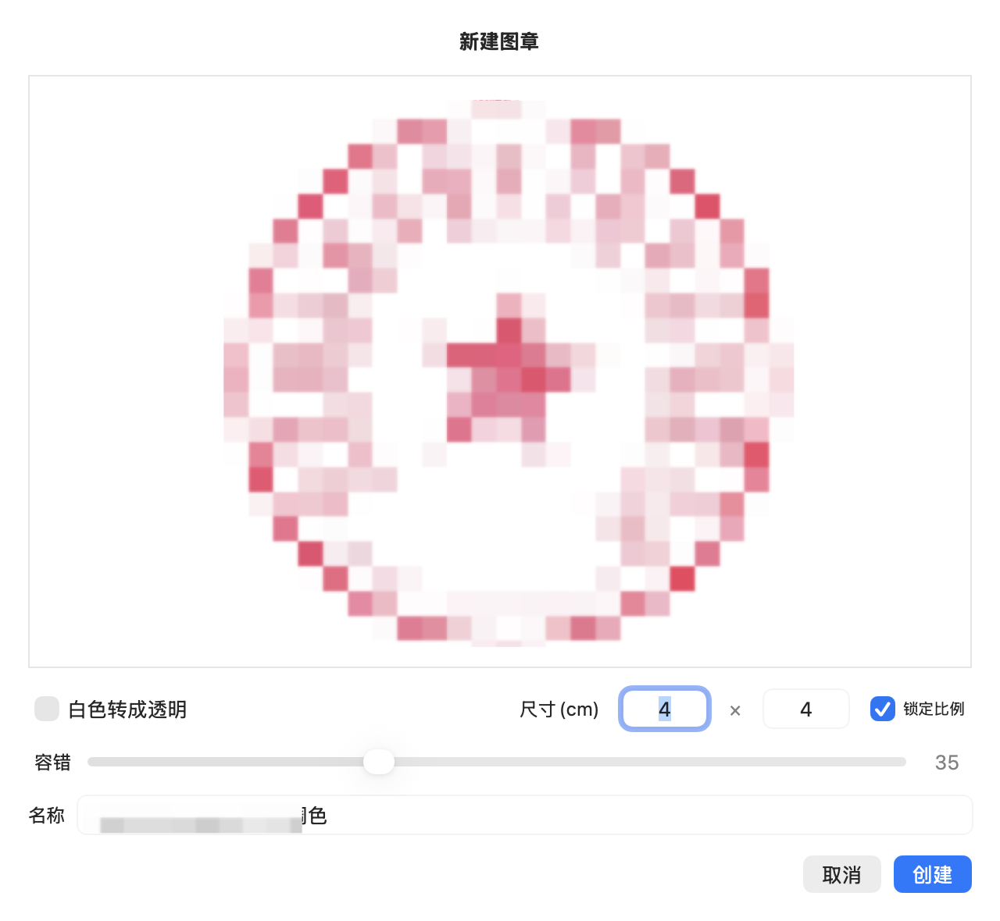
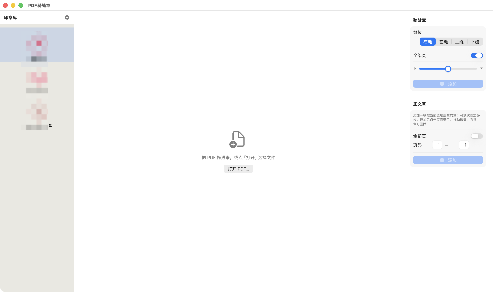

# PDF 騎縫章

[简体中文](README.md) | [English](README.en.md) | [繁體中文](README.zh-Hant.md)

一款原生 macOS 應用，為 PDF 文件加蓋**電子騎縫章**與**正文印章**。基於 SwiftUI + PDFKit/CoreGraphics 構建，零第三方依賴，純本地處理，不上傳任何文件。

  

## 介面預覽

| 蓋章主介面 | 新增圖章 |
|---|---|
|  |  |

| 初始介面 | |
|---|---|
|  | |

## 功能

### 騎縫章
- 四種縫位：右縫 / 左縫 / 上縫 / 下縫
- 頁面範圍：全部頁面或指定起止頁
- **上下偏移**：拖動滑桿即時調整章條在縫上的位置，多條騎縫章可錯開互不覆蓋
- 支援新增多條騎縫章實例，各自鎖定印章、縫位、範圍與偏移

### 正文印章
- 點擊頁面任意位置落章，可連續新增多枚
- 選取印章後：拖曳移動位置、右下角控制點等比縮放
- 每枚印章實例**鎖定新增時的印章**，切換印章庫互不影響

### 印章庫
- 匯入 PNG / JPG 圖片建立電子印章
- **白色轉透明**：附容錯閾值滑桿的即時預覽，掃描件、拍照圖均可處理
- 物理尺寸設定（公分），支援鎖定長寬比；同一枚印章在不同紙張規格上保持實際列印大小
- 印章庫持久化儲存，重開應用自動恢復

### 預覽與文件
- 頁面縮放：雙指捏合 / 輸入框 / 預設（25%–200%）
- 頁碼跳轉、底部狀態列
- 儲存（覆蓋原文件）/ 另存為 / 關閉
- `Esc` 取消選取，`⌘Z` / `Ctrl+Z` 復原上一次調整

## 環境需求

- macOS 13.0 以上
- Xcode Command Line Tools（`xcode-select --install`）

## 建置與執行

```bash
# 方式一：命令列直接執行
swift run PDFSeal

# 方式二：打包成 .app（同時產生 release/ 下的 zip 與 dmg）
./scripts/make_app.sh
```

> 注意：新版 macOS SwiftPM 沙箱與本機策略可能衝突，建置需帶 `--disable-sandbox`（腳本已處理）。

## 專案結構

```
Sources/
├── SealCore/    # 蓋章引擎：騎縫/正文幾何計算、PDF 匯出、測試資產
├── PDFSeal/     # SwiftUI 應用介面
└── SealTool/    # 無頭驗證 CLI（產生測試 PDF、蓋章、渲染比對）
scripts/         # 打包腳本（.app / zip / dmg）與圖示產生
```

## 技術要點

- 蓋章以 CoreGraphics 原生向量繪製貼片，**不點陣化**，產生檔案體積小、文字可選取
- 正確處理頁面 `/Rotate` 旋轉：旋轉頁的騎縫章按顯示方向計算
- 採用「按頁面尺寸分組 → 暫存 PDF → PDFKit 按頁序合併」方案，規避 macOS 26 上 per-page MediaBox 不生效的問題

## License

[MIT](LICENSE)
